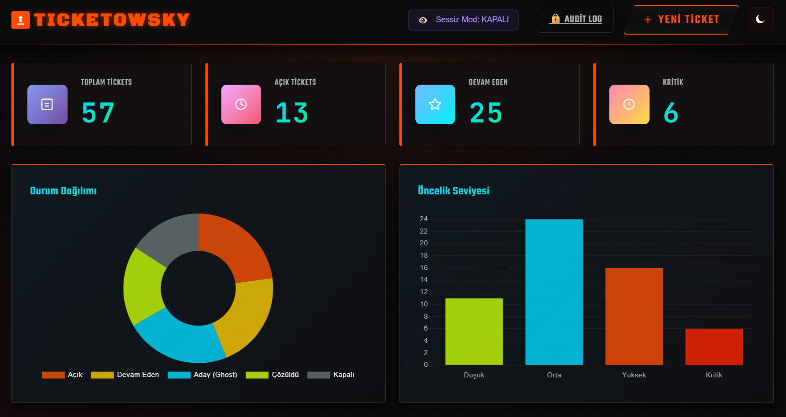
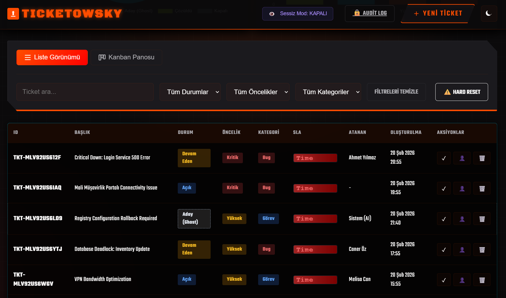
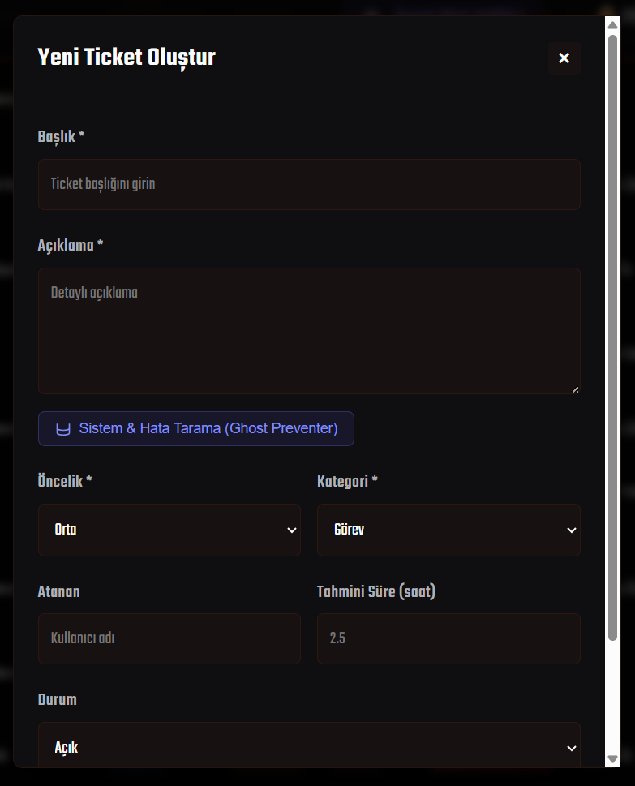
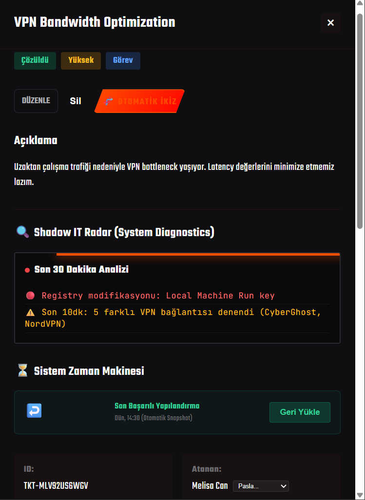
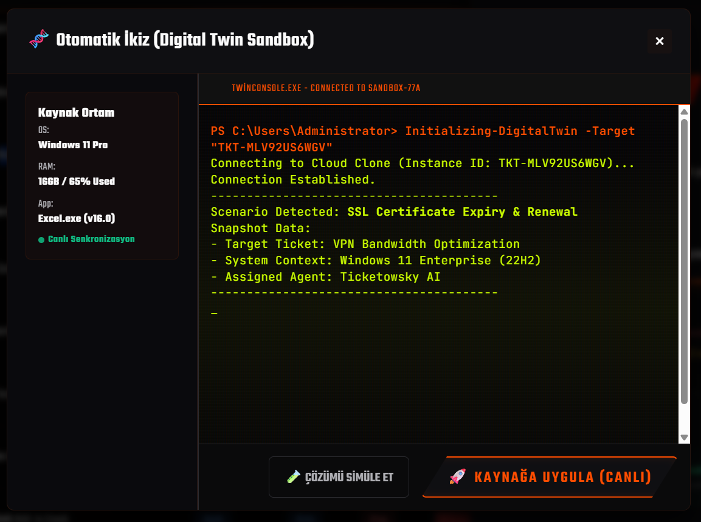
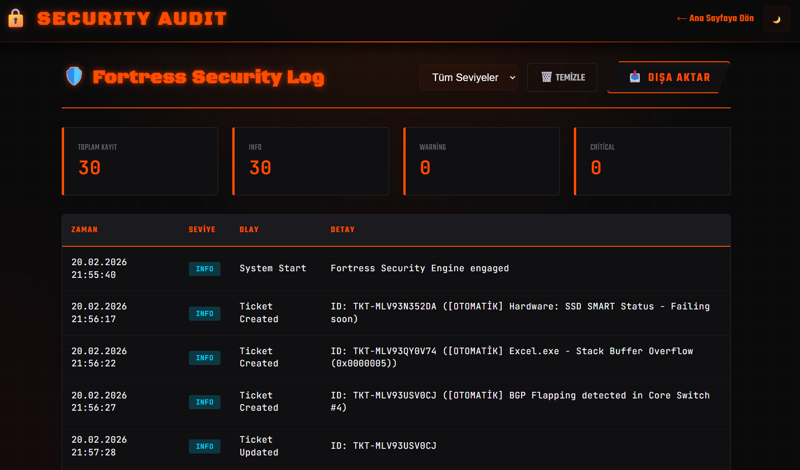

# 🎟️ TICKETOWSKY — Modern-Endüstriyel Ticket Yönetim Sistemi

> **Modern, tamamen istemci tabanlı, endüstriyel tasarımlı ticket yönetim sistemi.**  
> ServiceNow ve JIRA ilhamıyla geliştirilmiş; sunucu veya veritabanı gerektirmez.





---

## 📋 İçindekiler

- [Genel Bakış](#genel-bakış)
- [Özellikler](#özellikler)
- [Mimari & Teknik Yapı](#mimari--teknik-yapı)
- [Güvenlik Katmanı](#güvenlik-katmanı)
- [Kurulum](#kurulum)
- [Kullanım Kılavuzu](#kullanım-kılavuzu)
- [Modül Açıklamaları](#modül-açıklamaları)
- [Veri Yapısı](#veri-yapısı)
- [Bilinen Kısıtlamalar](#bilinen-kısıtlamalar)
- [Teknolojiler](#teknolojiler)

---

## Genel Bakış

TICKETOWSKY, IT destek ekipleri için tasarlanmış, sıfır bağımlılıklı (sunucu gerektirmez) bir ticket yönetim uygulamasıdır. Tüm veriler tarayıcının `localStorage` deposunda tutulur. Uygulama açıldığında 50'den fazla örnek ticket ile birlikte gelir ve hemen kullanıma hazırdır.

Kod tabanı tek bir `app.js` dosyasında (~2600 satır) toplanmış olup; durum yönetimi, güvenlik katmanı, render motoru, SLA hesaplayıcı ve tüm "devrimsel özellikler" bu dosyada yer almaktadır.

---

## Özellikler

### 🎨 Arayüz
| Özellik | Açıklama |
|---|---|
| **Dual Theme** | Industrial Dark ve High-Tech Lab (açık) tema. Molten orange vurgu renkleri. |
| **Liste Görünümü** | Tüm ticketları sıralı tablo formatında gösterir; sütunlara göre filtrelenebilir. |
| **Kanban Görünümü** | Sürükle-bırak desteğiyle sütunlar arası ticket taşıma. |
| **Spotlight Efekti** | Fare hareketine duyarlı, glassmorphism destekli kart parıltı animasyonu. |
| **Toast Bildirimleri** | Başarı, hata ve bilgi mesajları için SVG ikonlu bildirim sistemi. |

### ⚡ Ticket Yönetimi
| Özellik | Açıklama |
|---|---|
| **CRUD** | Ticket oluşturma, düzenleme, silme ve hızlı durum güncelleme. |
| **Filtreleme** | Arama, durum, öncelik ve kategori bazlı anlık filtreleme (debounce ile optimize). |
| **Detay Paneli** | Seçilen ticketin tam içeriği, yorumlar, eklentiler ve zaman çizelgesi. |
| **Yorum & Eklenti** | Ticket üzerine yorum ekleme ve dosya yükleme (base64 ile localStorage'da saklanır). |
| **Ticket Paslaması** | Ticket'ı ekip üyeleri arasında atayıp devredebilme. |

### 📊 İstatistik & Grafikler
- Toplam, açık, devam eden ve kritik ticket sayaçları
- Chart.js ile **Durum Dağılımı** (doughnut chart)
- Chart.js ile **Öncelik Dağılımı** (bar chart)

### ⏱️ SLA (Service Level Agreement) Takibi
- Önceliğe göre otomatik SLA hedefi: `Critical → 2s`, `High → 4s`, `Medium → 8s`, `Low → 24s`
- Gerçek zamanlı geri sayım saati (1 saniyelik interval ile güncellenir)
- Kanban kartlarında SVG tabanlı SLA halka göstergesi
- Durum renkleri: `on-track → caution → warning → breached`

### 🔬 Devrimsel Özellikler

#### 1. 🤖 Sessiz İzleme Modu (Shadow IT Radar)
Arka planda çalışarak ağ anomalilerini simüle eder ve otomatik "Candidate" statüsünde ticket üretir. Her 5 saniyede bir %30 ihtimalle anomali ticket oluşturur; maksimum 20 aday ticket ile sınırlıdır.

#### 2. 🧬 Digital Twin Sandbox
Seçilen ticket için izole bir sanal ortam açar. 9 farklı senaryo kütüphanesi (veritabanı kurtarma, DDoS azaltma, SSL yenileme, fidye yazılımı tespiti vb.) içerir. Simülasyon sonrası etki analizi yapılır ve alternatif "güvenli yol" önerileri sunulur. Başarılı simülasyon sonrasında çözüm tek tıkla canlı sisteme "uygulanabilir".

#### 3. 🔍 Ghost Ticket Preventer (Akıllı Tarama)
Ticket oluştururken sistemi tarar, hata bağlamını otomatik olarak açıklama alanına ekler ve donanım sağlık taramasını tetikler.

#### 4. 💓 Duygu & Stres Analizi
Ticket açıklama alanında yazarken tuş hızını ve belirli anahtar kelimeleri (`acil`, `çöktü`, `yandık` vb.) analiz eder. Panik tespitinde önceliği otomatik olarak "Kritik" yapar ve görsel uyarı gösterir.

#### 5. 🔧 Predictive Hardware Health
Ghost Preventer çalıştığında NVMe SSD, CPU sıcaklığı, batarya ve fan durumunu simüle eder. Kritik bileşenler için otomatik "Yedek Parça Rezervasyonu" rozeti gösterir.

#### 6. 🔮 Ghostwriter (IT Tercümanı)
Teknik IT jargonunu kullanıcı dostu, anlaşılır Türkçeye çeviren yorum asistanı. Belirli teknik ifadeler için önceden tanımlanmış eşleşme tablosuyla çalışır.

#### 7. 🕐 Zaman Makinesi (System Restore)
Sandbox içinde "Geri Yükle" butonu ile sanal ikizi önceki durumuna döndürür ve etki analiz sonuçlarını sıfırlar.

---

## Mimari & Teknik Yapı

```
TICKETOWSKY
├── index.html          # Ana uygulama kabuğu (DOM yapısı)
├── audit.html          # Güvenlik audit log görüntüleyicisi (bağımsız sayfa)
├── styles.css          # CSS değişkenleri, tema sistemi, animasyonlar
└── app.js              # Tüm uygulama mantığı (~2600 satır)
    ├── State Management        # tickets[], currentView, currentTheme, selectedTicketId
    ├── Security Utilities      # escapeHtml, sanitize*, maskSensitiveData, SecurityGuardian
    ├── SLA Management          # calculateSLA, formatSLATime, getSLATargetMinutes
    ├── LocalStorage            # saveToLocalStorage, loadFromLocalStorage, createSampleData
    ├── CRUD Operations         # createTicket, updateTicket, deleteTicket, getTicket
    ├── Rendering               # renderListView, renderKanbanView, renderDetailPanel
    ├── Filtering & DnD         # getFilteredTickets, handleDrag*, handleDrop
    ├── Charts                  # initCharts (Chart.js)
    ├── Modal & Panel           # openModal, closeModal, openDetailPanel, closeDetailPanel
    └── Feature Modules         # Sandbox, ShadowIT, HardwareHealth, Ghostwriter, SentimentAnalysis
```

**Veri akışı:**
1. Sayfa yüklendiğinde `loadFromLocalStorage()` → `tickets[]` dizisini doldurur
2. Her işlemden sonra `saveToLocalStorage()` → `localStorage['tickets']` güncellenir
3. `render()` → `updateStatistics()` + `initCharts()` + `renderListView()` veya `renderKanbanView()`
4. Güvenlik olayları → `SecurityGuardian.audit()` → `localStorage['security_audit_log']` → `audit.html`

---

## Güvenlik Katmanı

TICKETOWSKY, Rails Security Guide prensiplerine dayanan simüle bir güvenlik katmanı içerir:

### XSS Önleme
Tüm kullanıcı girdileri `escapeHtml()` ve `sanitize*()` fonksiyonlarından geçirilir. DOM manipülasyonu `innerHTML` yerine `textContent` ve `createElement` ile yapılır.

### CSRF Token Simülasyonu
`SecurityGuardian.generateToken()` ile oturum başına rastgele token üretilir. `createTicket` ve `updateTicket` çağrılarında `authenticity_token` doğrulanır.

### Mass Assignment Koruması
`PERMITTED_PARAMS` dizisi ile yalnızca izin verilen alanlar güncelleme işlemine kabul edilir. Bilinmeyen alanlar otomatik olarak görmezden gelinir.

### PII Maskeleme
API anahtarları (48+ karakter hex), şifre ifadeleri ve kredi kartı numaraları otomatik olarak `[REDACTED_*]` etiketiyle maskelenir.

### IDOR Koruması
`openDetailPanel` ve `updateTicket` fonksiyonları, var olmayan ticket ID erişimlerini `SecurityGuardian.audit(..., 'warning')` ile loglar.

### Güvenlik Audit Logu
Tüm güvenlik olayları `localStorage['security_audit_log']` içinde saklanır. `audit.html` sayfası bu logu görselleştirir; filtreleme (Info / Warning / Critical) ve JSON olarak dışa aktarma desteği sunar.

---

## Kurulum

Sunucu kurulumu gerektirmez. Sadece dosyaları indirip tarayıcıda açın:

```bash
git clone https://github.com/username/ticketowsky.git
cd ticketowsky
# index.html dosyasını tarayıcınızda açın
```

> **Not:** `file://` protokolü ile açıldığında `localStorage` tam olarak çalışır. CORS kısıtlaması için yerel bir HTTP sunucusu (örn. `python -m http.server 8080`) tercih edilebilir.

**İlk Açılış:**  
Uygulama, `ticketowsky_v2_fixed` anahtarını kontrol eder. Bu anahtar yoksa `createSampleData()` çalışır ve 50+ örnek ticket oluşturulur.

**Tüm Veriyi Sıfırlamak:**  
Filtre bölümündeki **Hard Reset** butonu `localStorage.clear()` yaparak sayfayı yeniler.

---

## Kullanım Kılavuzu

### Ticket Oluşturma
1. Sağ üstteki **+ Yeni Ticket** butonuna tıklayın.
2. Başlık, açıklama, öncelik, kategori ve atanan kişiyi doldurun.
3. **Kaydet** ile ticket oluşturulur ve listeye eklenir.

 

> **İpucu:** Açıklama alanına yazmaya başladığınızda Stres Analizi devreye girer. "Acil", "çöktü" gibi kelimeler yazarsanız öncelik otomatik Kritik'e yükseltilir.

### Kanban Görünümü
- Üstteki **Kanban** sekmesine geçin.
- Kartları sütunlar arasında sürükleyip bırakarak durumunu güncelleyin.
- Her karttaki halka gösterge, SLA süresinin ne kadarının tüketildiğini gösterir.

### Sessiz İzleme Modu
- Filtre panelindeki **Sessiz Mod** butonunu etkinleştirin.
- Sistem her 5 saniyede bir anomali ticket üretebilir (simüle).
- Butona tekrar basarak durdurabilirsiniz.

### Digital Twin Sandbox
1. Bir ticket'ı açın (Detay Paneli).
2. **🧬 Otomatik İkiz** butonuna tıklayın.
3. **Simülasyonu Çalıştır** ile sahte çözümü test edin.
4. Risk analizi ve alternatif yolları inceleyin.
5. **🚀 Kaynağa Uygula** ile ticket otomatik "Çözüldü" statüsüne geçer.



### Güvenlik Audit Logu
- `audit.html` dosyasını tarayıcıda açın.
- Tüm güvenlik olaylarını seviyeye göre filtreleyin.
- **Dışa Aktar** butonu ile JSON formatında indirin.



---

## Modül Açıklamaları

### `SecurityGuardian` (Nesne)
Uygulamanın merkezi güvenlik motorudur.

| Metod | İşlev |
|---|---|
| `generateToken()` | Oturum başına CSRF token üretir |
| `verifyToken(token)` | Token doğrular, uyumsuzlukta `critical` log yazar |
| `audit(event, details, severity)` | Güvenlik olayını loglar ve `localStorage`'a kaydeder |
| `loadAuditLog()` | `localStorage`'dan önceki logları yükler |
| `saveAuditLog()` | Güncel log dizisini `localStorage`'a yazar |

### `SCENARIO_LIBRARY` (Sabit)
Sandbox için 9 farklı IT senaryo şablonu içerir:
`database`, `network`, `security`, `adsync`, `fileserver`, `ui`, `hardware`, `loadbalancer`, `encryption`

Her senaryo; adım listesi (`steps`) ve risk tanımları (`risks`) barındırır. Risk tanımları; mesaj, alternatif eylem adı ve örnek PowerShell/CLI komutu içerir.

### `calculateSLA(ticket)` (Fonksiyon)
Ticket'ın geçen süresini ve SLA hedefini karşılaştırır. Çıktı:
```javascript
{
  status: 'on-track' | 'caution' | 'warning' | 'breached',
  percentage: Number,       // 0-100 arası tüketilen süre
  remainingSeconds: Number, // Kalan saniye
  isBreached: Boolean
}
```

---

## Veri Yapısı

### Ticket Nesnesi
```javascript
{
  id: "TKT-XXXXX",           // Otomatik üretilen benzersiz ID
  title: String,             // Sanitize edilmiş başlık (maks. 200 karakter)
  description: String,       // PII maskelenmiş açıklama (maks. 2000 karakter)
  status: "open" | "in-progress" | "resolved" | "closed" | "candidate",
  priority: "low" | "medium" | "high" | "critical",
  category: "bug" | "feature" | "task" | "support",
  assignee: String,          // Atanan kişi adı (maks. 100 karakter)
  estimatedHours: Number,    // Tahmini çözüm süresi (saat)
  createdAt: ISO8601,
  updatedAt: ISO8601,
  comments: [{ id, author, text, timestamp }],
  attachments: [{ id, name, type, data }],  // data: base64
  timeline: [{ action, user, timestamp }],
  sandboxSession: Object | null  // Digital Twin durumu
}
```

### Audit Log Girişi
```javascript
{
  id: Number,                // Date.now()
  timestamp: ISO8601,
  event: String,             // Örn: "CSRF Failure", "Ticket Created"
  details: String,           // escapeHtml ile sanitize edilmiş
  severity: "info" | "warning" | "critical"
}
```

---

## Bilinen Kısıtlamalar

| Konu | Durum |
|---|---|
| **Kalıcılık** | Tüm veriler `localStorage`'da tutulur; tarayıcı verisi silinirse kaybolur. |
| **Çok Kullanıcı** | Gerçek zamanlı çok kullanıcı desteği yoktur. Farklı sekmeler arası `storage` eventi dinlenir (audit.html). |
| **Dosya Boyutu** | Eklentiler base64 olarak saklandığından büyük dosyalar `localStorage` kotasını (≈5MB) doldurabilir. |
| **Ghostwriter** | Teknik→insan dil dönüşümü sabit eşleşme tablosuna dayanır; gerçek NLP içermez. |
| **Sandbox/Analiz** | Tüm "sistem taraması" ve "simülasyon" sonuçları tamamen simüle edilmiştir; gerçek sistem verisi okunmaz. |
| **CSRF/IDOR** | Güvenlik mekanizmaları eğitim/demo amaçlıdır; gerçek bir backend koruması değildir. |

---

## Teknolojiler

| Teknoloji | Kullanım Amacı |
|---|---|
| **Vanilla JavaScript (ES6+)** | Tüm uygulama mantığı |
| **HTML5 / CSS3** | Yapı ve stil (CSS custom properties, glassmorphism) |
| **Chart.js** | Doughnut ve bar grafikleri |
| **Google Fonts** | Black Ops One, Teko, JetBrains Mono |
| **localStorage API** | Veri kalıcılığı |
| **Web Storage Event** | Sekmeler arası audit log senkronizasyonu |

---

## 📄 Lisans

Bu proje MIT lisansı altında dağıtılmaktadır. Detaylar için `LICENSE` dosyasını inceleyiniz.

